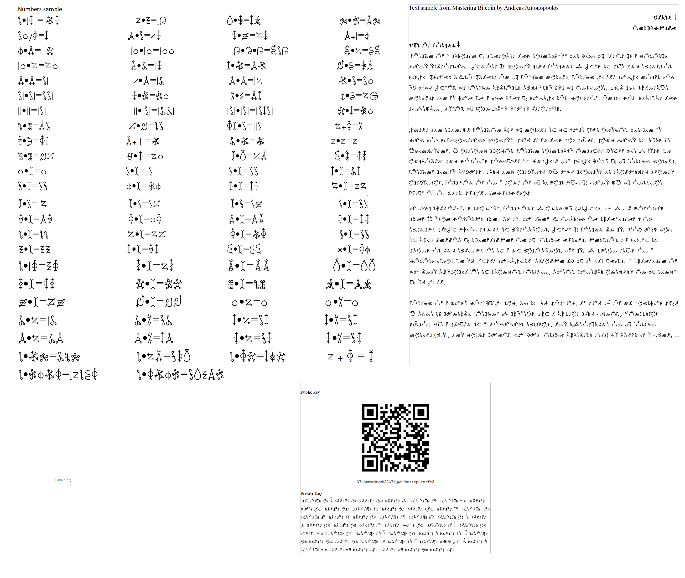

# BTC_puzzle

Having fun solving a Bitcoin puzzle

## Background

My attempt at solving the 0.025 BTC puzzle posted on Reddit:
    https://www.reddit.com/r/Bitcoin/comments/8krbd3/prize_inside_25mbtc_private_key_in_puzzle/

## Thoughts

I was too late to get the bounty (damn you bussiness travels), but it was fun!

Anyway, it was huge fun and an excellent learning opportunity. Before this I did not really know how Bitcoin private keys and addresses work. Many thanks to Reddit user [u/koljBmHsf](https://www.reddit.com/user/koljBmHsf)!